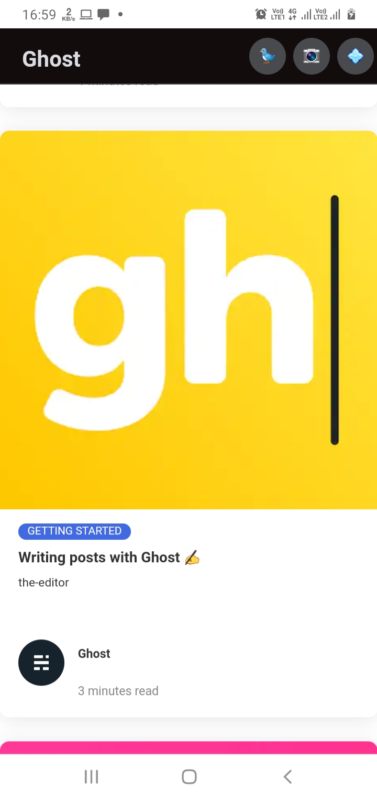
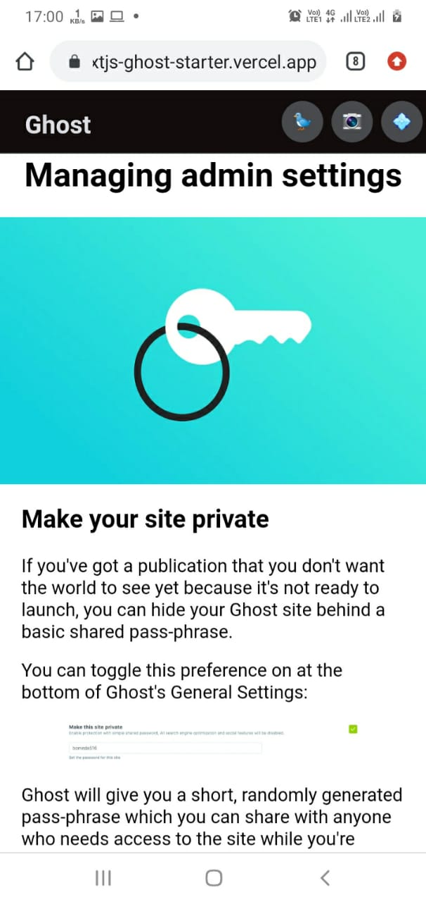
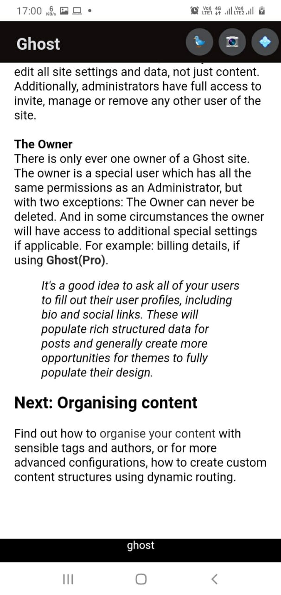

# Nextjs-ghost-starter

Simple Ghost default theme for next.js
# Mobile and desktop preview
<div class="row">



</div>


## Getting Started

By default, the starter will populate content from a default Ghost install located at https://next-ghost-blog.herokuapp.com/ .

To use your own install, you will need to edit the `site-config` config file with your credentials. Change the `apiUrl` value to the URL of your Ghost site. For Ghost(Pro) customers, this is the Ghost URL ending in `.ghost.io`, and for people using the self-hosted version of Ghost, it's the same URL used to access your site.

Next, update the `contentkey` value to a key associated with the Ghost site. A key can be provided by creating an integration within Ghost Admin. Navigate to Integrations and click "Add new integration". Name the integration appropriately and click create.

Finally, configure your desired URL in `site-config.js`, so links (e. g. canonical links) are generated correctly. Y


The default Ghost version that is used for this starter is `3.x`.
**Ghost <=3.0.0**
```
const appUrl = "https://next-ghost-blog.herokuapp.com/";
const contentKey = "382362c8a9a611d23db0adefc1";

```

# Deploying with Netlify

To deploy to your Netlify account, hit the button below.

[](https://app.netlify.com/start/deploy?repository=https://github.com/tewarig/nextjs-ghost-starter)

Content API Keys are generally not considered to be sensitive information, they exist so that they can be changed in the event of abuse; so most people commit it directly to their  config file. If you prefer to keep this information out of your repository you can remove this config and set [Netlify ENV variables](https://www.netlify.com/docs/continuous-deployment/#build-environment-variables) for production builds instead.

Once deployed, you can set up a [Ghost + Netlify Integration](https://docs.ghost.org/integrations/netlify/) to use deploy hooks from Ghost to trigger Netlify rebuilds. That way, any time data changes in Ghost, your site will rebuild on Netlify.

&nbsp;


This project is a starting point for a Flutter application.

A few resources to get you started if this is your first Flutter project:

- [Lab: Write your first Flutter app](https://flutter.dev/docs/get-started/codelab)
- [Cookbook: Useful Flutter samples](https://flutter.dev/docs/cookbook)

For help getting started with Flutter, view our
[online documentation](https://flutter.dev/docs), which offers tutorials,
samples, guidance on mobile development, and a full API reference.
